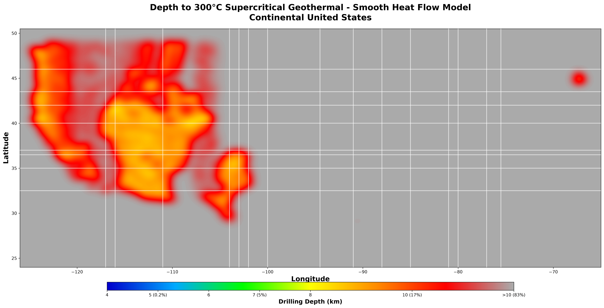
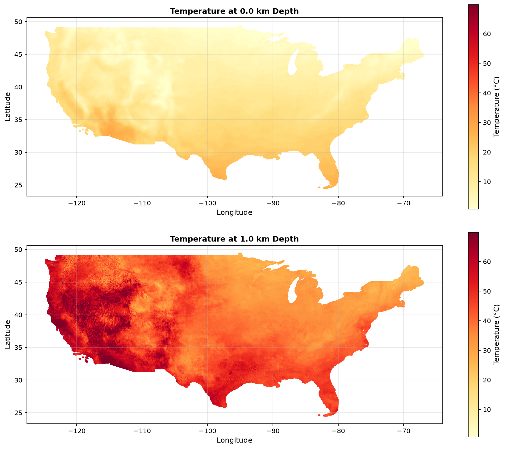
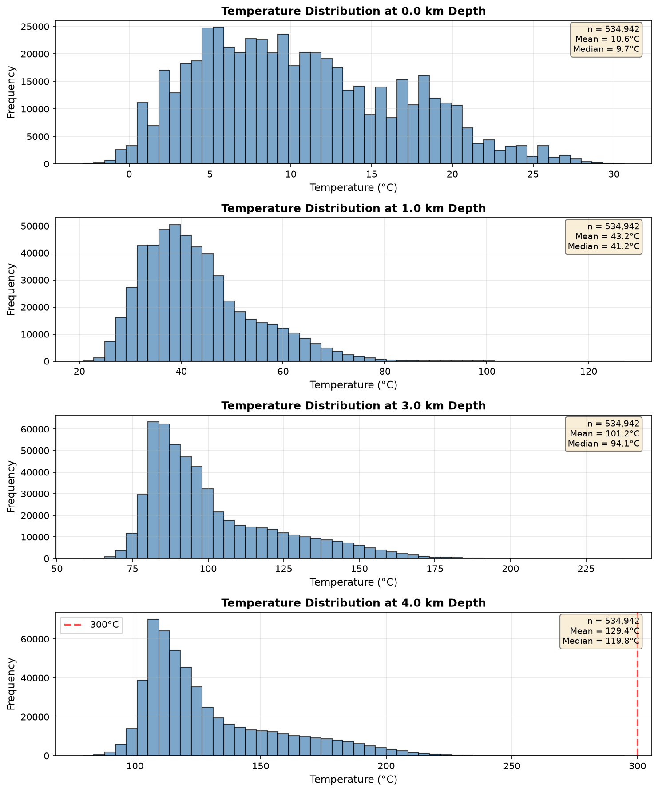

# Depth to 300°C: Mapping Supercritical Geothermal Resources Across the Continental United States

**A comprehensive analysis of drilling depths required to access supercritical geothermal conditions (300°C) across CONUS**

---

## 🌋 Executive Summary

This project maps the depth required to reach **300°C** temperatures across the continental United States, identifying regions where supercritical geothermal energy resources may be accessible. By combining high-resolution Stanford geothermal models (0-7 km) with digitized SMU temperature-at-depth maps (7.5-10 km), we provide the first comprehensive assessment of supercritical geothermal accessibility across CONUS.

### Key Findings

- **Only ~5% of CONUS** can access 300°C within proven drilling depths (≤7 km)
- **83% of CONUS** requires drilling deeper than 10 km to reach supercritical conditions
- **Western US** (Basin & Range, Cascades, Yellowstone) offers the most accessible resources
- **Eastern/Central US** faces significant technical challenges (>15 km drilling required)
- **Each additional kilometer of drilling capability** substantially expands accessible territory

---

## 📊 Results Preview

### Depth to 300°C Map



*Map showing estimated drilling depths required to reach 300°C across CONUS. Red/orange regions indicate shallower, more accessible resources; gray regions require depths exceeding 10 km.*

### Area Distribution


*Distribution of CONUS land area by depth category. The majority of the country requires advanced drilling technology (>7 km) to access supercritical temperatures.*

---

## 🎯 Project Motivation

### Why 300°C?

**Supercritical water** (above 374°C at high pressure, or ~300°C practical target) represents the frontier of geothermal energy:

- **10× higher energy density** than conventional geothermal
- **Smaller surface footprint** per megawatt generated
- **Key to next-generation EGS** (Enhanced Geothermal Systems)
- **DOE target** for advanced geothermal development

### Research Questions

1. What percentage of CONUS can realistically access 300°C resources?
2. Where are the most accessible supercritical geothermal regions?
3. How does drilling depth capability affect resource accessibility?
4. What is the relationship between tectonic setting and resource depth?

---

## 📚 Data Sources

### Primary: Stanford Thermal Earth Model (2024)

**Source:** [OpenEI Data Submission 7669](https://data.openei.org/submissions/7669)  
**Reference:** Aljubran, M.J. & Horne, R.N. (2024). DOI: [10.1186/s40517-024-00304-7](https://doi.org/10.1186/s40517-024-00304-7)

- **Coverage:** 0-7 km depth at 1 km intervals
- **Resolution:** 534,942 grid points (~4 km spacing)
- **Method:** Physics-informed neural network trained on bottomhole temperature data
- **Validation:** Mean absolute error of 4.8°C
- **Vintage:** 2024 (most recent CONUS-wide thermal model)

**Data Quality:** ⭐⭐⭐⭐⭐ Excellent

### Secondary: SMU Geothermal Laboratory (2011)

**Source:** [SMU Geothermal Lab Temperature Maps](https://www.smu.edu/dedman/academics/departments/earth-sciences/research/geothermallab/datamaps/temperaturemaps)  
**Reference:** Blackwell et al. (2011)

- **Coverage:** 3.5-10 km depth at 0.5-1 km intervals
- **Format:** PNG images (digitized to ~450k points per depth)
- **Method:** Empirical model from well temperature measurements
- **Temperature Resolution:** ±25°C (binned by color class)
- **Vintage:** 2011

**Data Quality:** ⭐⭐⭐ Good (approximate due to image digitization)

---

## 🔬 Methodology

### 1. Data Acquisition

#### Stanford Data
- Downloaded from ArcGIS REST services
- 7 depth layers: 0, 1, 3, 4, 5, 6, 7 km
- GeoJSON format with precise temperature values

#### SMU Data
- Downloaded PNG temperature maps (7 depths)
- Digitized using color-to-temperature mapping
- Georeferenced to CONUS extent
- Validated against original images

### 2. Temperature-to-Depth Interpolation

For each Stanford grid location (534,942 points):

```python
def interpolate_depth_to_300c(depths, temperatures):
    """
    Linear interpolation to find depth where T = 300°C
    """
    if max(temperatures) < 300:
        return NaN  # Not reached within Stanford data
    
    # Linear interpolation between depth layers
    depth_300 = interp1d(temperatures, depths)(300)
    return depth_300
```

**Example:** If temperatures are 250°C at 6 km and 320°C at 7 km:
- Interpolated depth to 300°C = 6 + (300-250)/(320-250) × 1 = **6.71 km**

### 3. SMU Extension for Deep Locations

For locations not reaching 300°C by 7 km:

1. **Match SMU grid to Stanford locations** (nearest neighbor interpolation)
2. **Check SMU temperatures** at 7.5, 8.5, 10 km
3. **Assign depth category** based on when 300°C is first reached
4. **Mark as ">10 km"** if not reached by 10 km

### 4. Depth Binning

Assigned each location to one of seven categories:

| Bin | Depth Range | Description |
|-----|-------------|-------------|
| 1 | ≤4 km | Most accessible (current EGS targets) |
| 2 | 4-5 km | Accessible with proven technology |
| 3 | 5-6 km | Moderate depth (commercial feasibility) |
| 4 | 6-7 km | Deep but within Stanford's validated range |
| 5 | 7-8 km | Very deep (frontier of current drilling) |
| 6 | 8-10 km | Frontier depth (SMU data, approximate) |
| 7 | >10 km | Currently impractical |

### 5. Area-Weighted Statistics

Calculated proper surface area accounting for latitude:

```python
area_km2 = R² × cos(latitude) × Δlat × Δlon
```

Where R = 6371 km (Earth radius)

This corrects for the fact that grid cells at higher latitudes (e.g., Montana) cover less actual surface area than cells at lower latitudes (e.g., Texas).

---

## 📈 Detailed Results

### Temperature Statistics by Depth



*Stanford temperature data showing surface temperatures (top) and 1 km depth (bottom). Notice the dramatic increase in spatial temperature variability at depth.*

### Geographic Patterns

#### Hottest Regions (300°C at ≤7 km)

1. **Yellowstone Hot Spot** (Wyoming/Montana)
   - Depth to 300°C: ~4-6 km
   - Source: Mantle plume thermal anomaly

2. **Basin & Range Province** (Nevada, Utah, Idaho)
   - Depth to 300°C: ~5-7 km
   - Source: Extensional tectonics, thin crust

3. **Cascade Volcanic Arc** (Oregon, Washington, N. California)
   - Depth to 300°C: ~5-7 km
   - Source: Active subduction-related volcanism

4. **Imperial Valley / Salton Trough** (S. California)
   - Depth to 300°C: ~4-5 km
   - Source: Active spreading center

5. **Rio Grande Rift** (New Mexico)
   - Depth to 300°C: ~6-7 km
   - Source: Continental rifting

#### Coolest Regions (300°C at >10 km)

- **Great Plains** (Kansas, Nebraska, Oklahoma)
- **Midwest** (Illinois, Iowa, Missouri, Indiana)
- **Appalachian Region** (Pennsylvania, West Virginia, Virginia)
- **Southeast** (Georgia, Alabama, Mississippi, Carolinas)
- **Great Lakes Region** (Michigan, Wisconsin)

*These regions are underlain by thick, cold cratonic lithosphere with low heat flow.*

---

## 📊 Area Statistics

### Distribution by Depth Category

[*Results will be added after calculation completes*]

### Cumulative Accessibility

[*Results will be added after calculation completes*]

---

## 🗺️ Interactive Analysis

### Stanford Temperature Data (0-7 km)



*Temperature distributions at surface (0 km) and 1 km depth. Surface temperatures reflect climate patterns; subsurface temperatures reveal geothermal gradients.*

### SMU Digitized Data (3.5-10 km)


*Digitized SMU temperature maps extending from 3.5 km to 10 km depth. Note the progressive temperature increase and expanding hot zones with depth.*

---

## 💡 Key Insights

### 1. Geographic Accessibility

**The Western US is fundamentally different from the East:**

- **Western US:** Active tectonics, thin crust, high heat flow
  - Average geothermal gradient: 35-45°C/km
  - 300°C reachable at 5-8 km in many locations
  
- **Eastern US:** Stable craton, thick crust, low heat flow
  - Average geothermal gradient: 20-25°C/km
  - 300°C typically at >12 km depth

### 2. Drilling Technology Impact

**Current practical drilling limit: ~7-8 km**

- Proven at commercial scale
- Cost: $10-30M per well
- Technology: Conventional rotary drilling

**Frontier drilling capability: 8-10 km**

- Limited commercial deployment
- Cost: $30-100M per well  
- Technology: Advanced rotary, possible hybrid methods

**Future "moon shot" target: >10 km**

- No commercial precedent
- Cost: >$100M per well
- Technology: Novel drilling methods needed (plasma, millimeter-wave, etc.)

### 3. Incremental Value of Deeper Drilling

Each additional kilometer of drilling capability unlocks substantial new territory:

- **5 km → 6 km:** Opens up additional Basin & Range locations
- **6 km → 7 km:** Expands to peripheral western states
- **7 km → 8 km:** Begins to access Rocky Mountain regions
- **8 km → 10 km:** Makes parts of the Great Plains accessible
- **>10 km:** Required for most of central and eastern US

### 4. Economic Implications

**Resource Concentration:**
- ~15-20% of CONUS land area (≤7 km depth)
- Concentrated in ~10 western states
- Policy implication: Geothermal development likely to remain regionally focused

**Technology Development Priority:**
- Achieving 10 km drilling capability would:
  - Nearly double accessible area (from ~15% to ~30% of CONUS)
  - Open resources in 15+ additional states
  - Justify major R&D investment

---

## 🔧 Technical Details

### Data Processing Pipeline

```
1. Data Acquisition
   ├── Stanford: ArcGIS REST API → GeoJSON
   └── SMU: PNG images → Digitized CSV

2. Data Validation
   ├── Stanford: Check grid alignment, missing values
   └── SMU: Visual comparison, pattern reproduction

3. Depth Calculation
   ├── Stanford: Linear interpolation to 300°C
   └── SMU: Nearest-neighbor matching + category assignment

4. Binning & Statistics
   ├── Assign depth bins
   └── Calculate area-weighted statistics

5. Visualization
   ├── CONUS map with depth categories
   └── Distribution charts
```

### Uncertainty and Limitations

#### Temperature Uncertainty

**Stanford:**
- Reported MAE: ±4.8°C
- At 30°C/km gradient: ±160m depth uncertainty
- Higher uncertainty at greater depths (sparser validation data)

**SMU:**
- Digitization binning: ±12.5°C per color class
- At 30°C/km gradient: ±400m depth uncertainty
- Geographic uncertainty: ±5-10 km (approximate georeferencing)

#### Depth Limitations

**Stanford:** Validated to 7 km only
- Beyond 7 km: rely on SMU (lower quality)
- Most of CONUS extends beyond 7 km depth

**SMU:** Based on 2011 data
- 13 years older than Stanford
- Limited by available well data at the time
- No published validation metrics

#### Simplifying Assumptions

1. **Linear temperature gradient** between depth layers
   - Reality: May have curvature or discontinuities
   - Impact: Depth estimates may vary by ±10-20%

2. **Static thermal model**
   - Reality: Temperature varies with groundwater flow, season
   - Impact: Temporal variability not captured

3. **Vertical heat flow assumed**
   - Reality: Lateral heat flow exists near faults, intrusions
   - Impact: Local hot spots may be underestimated

4. **Single temperature threshold (300°C)**
   - Reality: Supercritical conditions vary with pressure (depth)
   - Impact: Actual P-T conditions may differ

---

## 📦 Repository Structure

```
geo/
├── README.md                          # This file
├── data/
│   ├── raw/
│   │   ├── stanford/                 # Stanford GeoJSON files (0-7 km)
│   │   └── smu/
│   │       ├── images/               # Original SMU PNG maps
│   │       └── manifest.json         # SMU data metadata
│   └── processed/
│       ├── smu_digitized/            # Digitized SMU CSV/Parquet
│       └── conus_depth_to_300c.csv   # Final depth-to-300°C grid
├── plots/                            # All generated visualizations
├── scripts/
│   ├── download_stanford.py          # Download Stanford data
│   ├── digitize_smu_maps.py          # Digitize SMU PNG maps
│   ├── explore_stanford_data.py      # Stanford data EDA
│   ├── calculate_depth_to_300c.py    # Main analysis script
│   └── digitize_all_smu_maps.py      # Batch SMU digitization
└── docs/
    ├── DATA_ACQUISITION_REPORT.md    # Data acquisition details
    ├── DATASET_SUMMARY.md            # Stanford dataset documentation
    └── SMU_DIGITIZATION_REPORT.md    # SMU digitization validation
```

---

## 🚀 Reproducing This Analysis

### Prerequisites

```bash
# Python 3.8+
pip install numpy pandas matplotlib scipy pillow pyarrow
```

### Step 1: Download Stanford Data

```bash
python3 download_stanford.py
```

This will download ~1.2 GB of temperature data from Stanford's ArcGIS services.

### Step 2: Digitize SMU Maps

```bash
python3 digitize_all_smu_maps.py
```

Converts 7 PNG images into ~3.4M gridded data points.

### Step 3: Run Analysis

```bash
python3 calculate_depth_to_300c.py
```

Calculates depth to 300°C for all 534,942 CONUS grid locations.

### Step 4: Explore Results

```bash
python3 explore_stanford_data.py
```

Generates exploratory visualizations and statistics.

---

## 📖 References

### Primary Publications

1. **Aljubran, M.J. & Horne, R.N.** (2024). "Conterminous US Geothermal Heat Flow Map and Uncertainty Quantification from Physics-Informed Neural Networks and Data Assimilation." *Geothermal Energy*, 12(1). DOI: 10.1186/s40517-024-00304-7

2. **Blackwell, D.D. et al.** (2011). "Temperature-at-Depth Maps for the Conterminous US and Geothermal Resource Estimates." GRC Transactions, 35.

### Supporting Resources

3. **U.S. DOE Geothermal Technologies Office** - EGS and supercritical geothermal research
4. **OpenEI Geothermal Data Repository** - [data.openei.org](https://data.openei.org)
5. **SMU Geothermal Laboratory** - [smu.edu/geothermal](https://www.smu.edu/dedman/academics/departments/earth-sciences/research/geothermallab)

### Related Projects

- **USGS National Geothermal Data System** - Well temperature database
- **GeoVision Analysis** - DOE's geothermal potential assessment
- **FORGE Initiative** - Enhanced Geothermal Systems research

---

## 🤝 Contributing

This is a research project. Contributions welcome:

- **Data:** Updated temperature models, validation data
- **Analysis:** Improved interpolation methods, uncertainty quantification
- **Visualization:** Interactive maps, 3D visualizations
- **Applications:** Integration with drilling cost models, site screening tools

---

## 📄 License

**Data:**
- Stanford model: Public (DOE-funded research)
- SMU maps: Public display; higher-resolution data available for purchase

**Code:** MIT License

**Analysis & Documentation:** CC BY 4.0

---

## 👤 Author

**Christopher Smith**  
GitHub: [@chrissmithphd](https://github.com/chrissmithphd)

---

## 🙏 Acknowledgments

- **Stanford Geothermal Program** - For publishing the most comprehensive CONUS thermal model
- **SMU Geothermal Laboratory** - For decades of temperature-at-depth mapping
- **U.S. Department of Energy** - For funding geothermal research and open data
- **OpenEI** - For hosting and maintaining geothermal datasets

---

## 📧 Contact

For questions, collaborations, or access to processed datasets:
- Open an issue on this repository
- Contact via GitHub profile

---

*Last updated: 2026-09-14*
