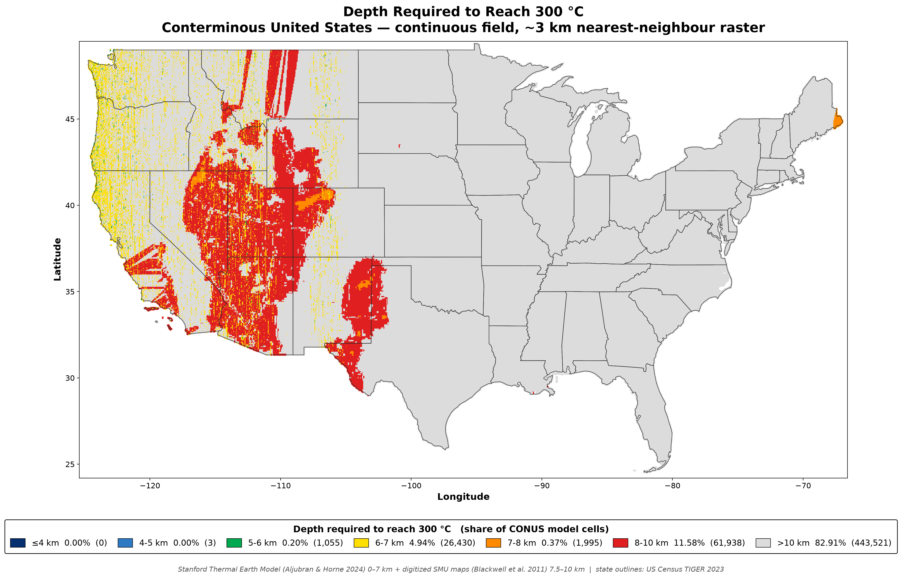
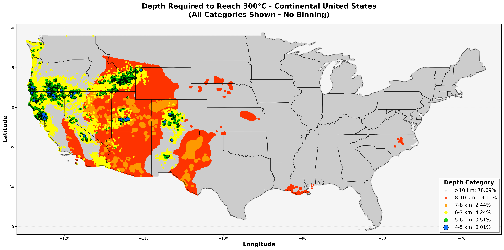
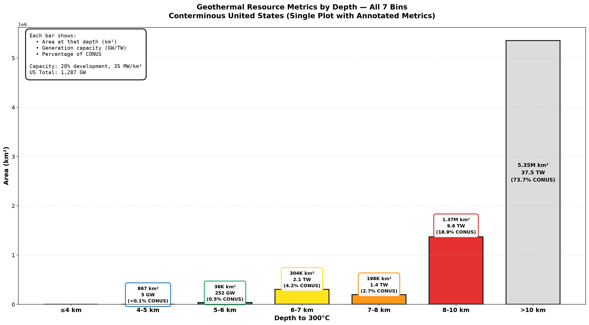
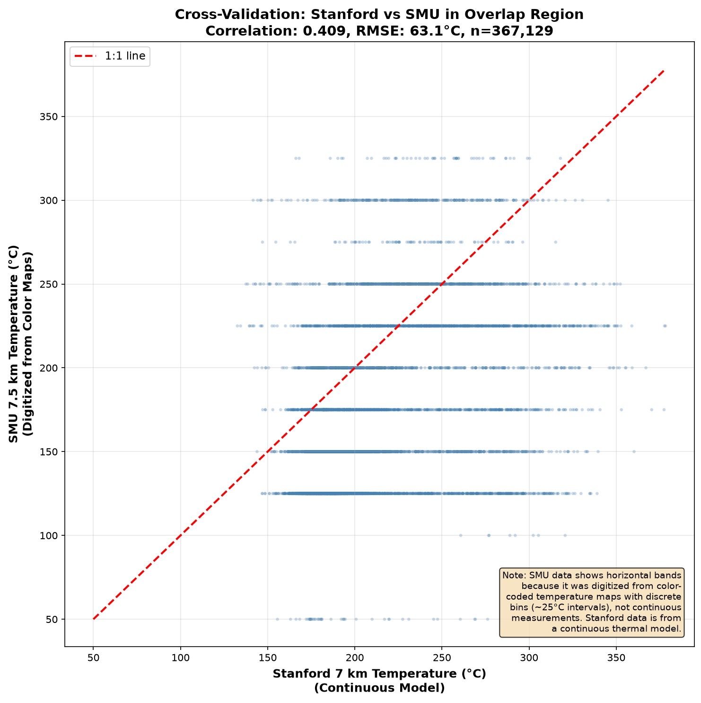
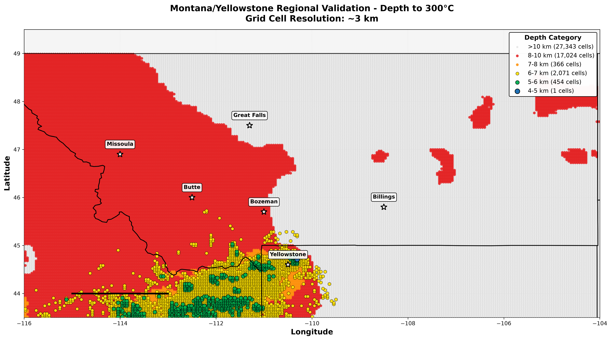
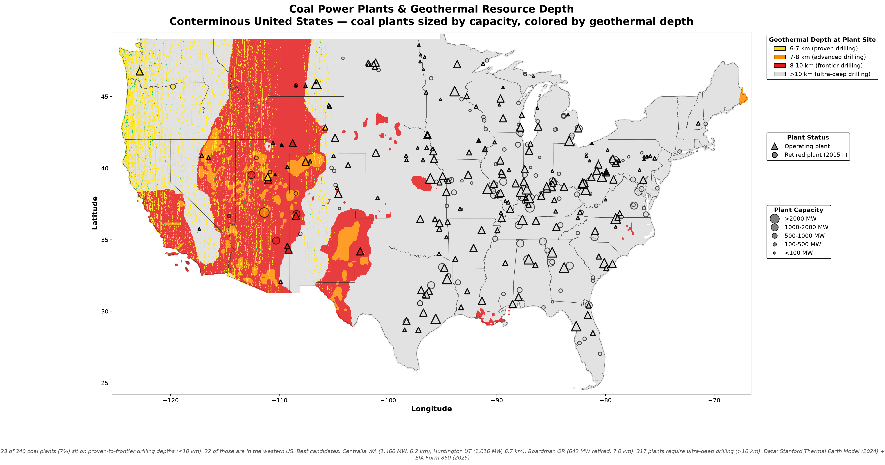
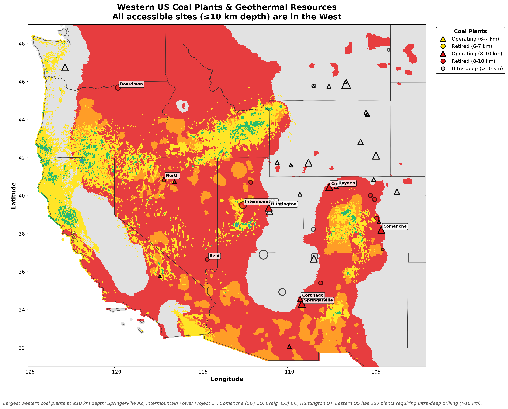
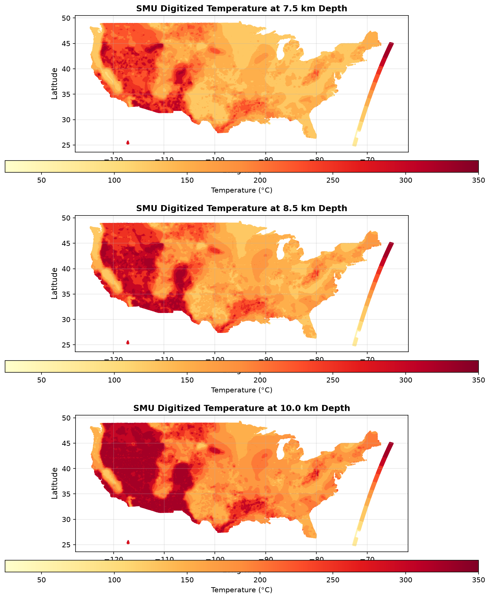
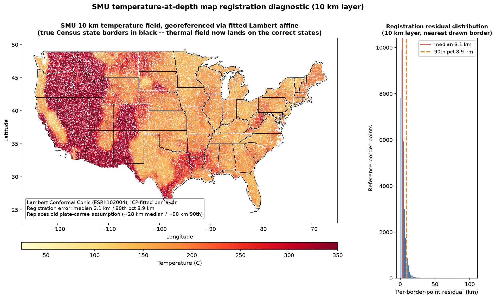

<div align="center">

# 🌋 Depth to 300 °C

### Exploring where 300°C geothermal resources may be accessible across CONUS

[](#the-grid)
[](https://data.openei.org/submissions/7669)
[](https://www.smu.edu/dedman/academics/departments/earth-sciences/research/geothermallab/datamaps/temperaturemaps)
[](#license)

**How deep must you drill to hit 300 °C?**
In the Stanford thermal model, roughly **5% of CONUS reaches 300 °C within 7 km** — the best-constrained part of this estimate. Extending the modeled drilling envelope to **10 km** with the digitized SMU maps raises the estimated accessible area to **roughly 26%** (~1.9 million km²); the remaining ~74% would require drilling deeper than 10 km. These are **modeled, exploratory figures — a screening estimate, not a measured resource assessment.**

</div>

---

## The map



*Continuous nearest-neighbour field at ~3 km resolution. State outlines are US Census
TIGER 2023 boundaries. Grey regions require >10 km drilling depth.*

**🔍 [Open the interactive, zoomable version →](https://chrissmithphd.github.io/conus-geothermal-300c/)**



*All 534,942 cells drawn individually. Shallow cells (green = 5–6 km, blue = 4–5 km, navy = ≤4 km) are drawn larger and last to remain visible at CONUS scale — this overemphasizes rare shallow resources to show where they exist.*

---

## Where the models suggest accessible resources may be

The modeled ≤10 km resource is overwhelmingly concentrated west of roughly **−100° longitude** — the divide between the actively extending, thin-crust West and the cold, thick, stable craton beneath the eastern two-thirds of the country. But "the West" is not one uniform target. The **2,770 cells that reach 300 °C within 6 km** — within the range of existing deep-drilling experience — cluster in a handful of distinct volcanic and rift settings, *not* a single contiguous province. Grouping those cells by the state they fall in (every state with ≤6 km cells is shown):

| Setting | Where the shallow cells are | Cells ≤6 km |
|---|---|---:|
| **Cascades + California rifts** | N. California / Oregon / Washington Cascade axis; Salton Trough, Coso, Long Valley, Geysers (CA) | 1,423 (CA 911 · OR 501 · WA 11) |
| **Yellowstone–Snake River Plain** | Hotspot track arcing NE across southern Idaho toward Yellowstone; Wyoming/Montana margins | 764 (ID 703 · WY 41 · MT 20) |
| **Colorado — upper Arkansas / Rio Grande rift** | Aspen–Salida corridor (Sawatch Range, Mount Princeton), San Luis Valley | 199 (≈130 in the Aspen–Salida corridor) |
| **Northern Nevada** | NW/N Nevada near the NE-California & S-Oregon corner (Black Rock, Surprise Valley) — *not* statewide Basin & Range | 151 |
| **Central–southern Utah** | Roosevelt Hot Springs / FORGE, Sevier & Black Rock basins — *not* the northern Wasatch | 134 |
| **Rio Grande rift (New Mexico)** | Valles/Jemez, Socorro, Rio Grande corridor | 45 |
| **Arizona** | Single cell in the NW Arizona Basin & Range | 1 |
| **Great Plains → Atlantic** | Stable craton — thick, cold lithosphere (deepest 300 °C is 8–10 km in the East Texas Basin) | **0** |

The shallow resource is **not a single contiguous mega-target**. The interiors of Nevada and Utah are mostly 7–10 km; the genuinely shallow cells sit at the *edges* (northern Nevada, central-southern Utah) and in the volcanic/rift settings above. The **Colorado upper Arkansas corridor between Aspen and Salida** — the northern reach of the Rio Grande rift — is the densest shallow cluster in the interior Rockies, with ≈130 cells ≤6 km.

The very shallowest cells (**4–5 km**, 64 cells) sit on the Oregon/Washington Cascade axis and in California; the 5–6 km tier broadens to pull in the Snake River Plain and the Colorado corridor.

---

## Illustrative generation scenario by depth



| Depth | Area (km²) | % CONUS | Capacity (GW) | × US Total |
|---|---:|---:|---:|---:|
| ≤4 km | 0 | 0.00 | 0 | 0.0 |
| 4–5 km | 867 | 0.01 | 5.2 | 0.0 |
| 5–6 km | 36,014 | 0.50 | 252 | 0.2 |
| 6–7 km | 304,350 | 4.19 | 2,130 | 1.7 |
| 7–8 km | 197,784 | 2.72 | 1,384 | 1.1 |
| 8–10 km | 1,371,312 | 18.88 | 9,599 | 7.5 |
| **>10 km** | **5,353,343** | **73.70** | **—** | **—** |
| **≤10 km** | **1,910,326** | **26.30** | **13,371** | **10.4** |
| *Total* | *7,263,669* | *100.00* | *13,371** | *10.4** |

Area is **latitude-weighted** (`A = R² · cos φ · Δφ · Δλ`). Capacity values shown only for ≤10 km bins where the analysis identifies 300°C within the modeled range. The >10 km category has no capacity estimate because the actual depth to 300°C is unknown for those cells. Values show the scale implied by assumed 35 MW/km² power density (superhot geothermal, 300-400°C) and 20% development; they are not resource or generation forecasts. IDDP-2 demonstrated 45 MW/well at 427°C. US total capacity: **1,287 GW** (coal: 180 GW). See [`research/ENERGY_GENERATION_RESEARCH.md`](research/ENERGY_GENERATION_RESEARCH.md) for details.

---

## Methodology

### Data Integration

The analysis combines two independent thermal models to map subsurface temperatures across the continental US:

**Stanford Thermal Earth Model (2024)** — 0–7 km depth, 534,942 grid cells at ~3 km resolution. Provides continuous temperature interpolation from surface to mid-crustal depths.

**SMU Geothermal Lab (2011)** — 7.5–10 km depth, 1.65M digitized points from published temperature maps. Extends coverage into deep basement where sparse borehole data constrain continental heat flow.

At each grid cell, we interpolate through the temperature profile to identify the depth at which conditions cross 300 °C — the threshold used here for superhot geothermal screening. Stanford layers are sorted by geographic coordinates before combining to ensure spatial alignment. SMU matching uses geodetic distance filtering (50 km threshold, cos(latitude) correction for longitude convergence at high latitudes).



*Cross-validation at 7 km overlap: r = 0.690, RMSE = 53 °C across 532,455 matched locations (Stanford runs ~39 °C warmer than the digitized SMU estimates). Horizontal banding in SMU data reflects the discrete temperature bins in the source maps (~25 °C intervals).*

### Data Characteristics

- **Stanford**: Continuous depth estimates (e.g., "300 °C at 6.37 km")
- **SMU**: Categorical upper bounds (e.g., "≥300 °C by 8.5 km" → crossing occurs in 7.5–8.5 km range)
- **Interpolation**: Linear between sampled depths; assumes monotonic temperature increase
- **Coverage** (of 534,942 cells analyzed) — *within 7 km:* 4.8% of cells / 4.7% of CONUS area (Stanford); *within 10 km:* 26.5% of cells / 26.3% of CONUS area (Stanford + SMU). Area-weighted percentages are lower because they down-weight the smaller ground footprint of high-latitude cells; the area figures are the ones used in the headline and generation table

Both datasets are interpolated thermal models, not direct borehole measurements. SMU maps were digitized from published figures, introducing color quantization and geolocation uncertainty. Results are consistent with known crustal structure: thin, hot crust in the Basin & Range; thick, cold cratonic lithosphere beneath the eastern two-thirds of the continent.

**[→ Regional sanity checks and methodology notes](VALIDATION.md)**

### Regional sanity check

Montana/Yellowstone regional sanity check:



*Montana region: Eastern plains (>10 km, gray) vs western mountains/Yellowstone (6-8 km, yellow/red). Clear tectonic boundary visible at ~110°W longitude.*

**[→ See the full regional sanity checks, including a Yellowstone close-up](VALIDATION.md)**

---

## Coal infrastructure and modeled geothermal potential



*Coal power plants sized by capacity, colored by geothermal depth. Triangles = operating, circles = retired since 2015.*

### Summary

**335 in-coverage US coal plants analyzed** (5 Alaska plants excluded — they lie outside the CONUS grid domain):
- 25 plants (7%) at ≤10 km depth — only **one** shallower than 8 km
- 20 of those in western US
- 310 plants (93%) at >10 km depth

Apart from a single 62 MW cogeneration plant at 6–7 km, every coal plant sitting on ≤10 km of depth-to-300 °C is in the **8–10 km frontier band**, where 300 °C is only reached at the deepest SMU layer.

### Coal sites worth further screening

All 25 in-coverage coal plants sitting on ≤10 km of depth-to-300 °C, shallowest first then by capacity. Depth shown is the SMU layer where 300 °C is first met.

| Plant | State | Capacity | Status | Depth to 300 °C |
|-------|-------|----------|--------|-----------------|
| Argus Cogen | CA | 62 MW | Operating | 6.8 km |
| Springerville | AZ | 1,766 MW | Operating | 8.5 km |
| Intermountain Power | UT | 1,640 MW | Retired 2025 | 8.5 km |
| North Valmy | NV | 290 MW | Operating | 8.5 km |
| Kennecott Power Plant | UT | 182 MW | Retired 2019 | 8.5 km |
| Martin Lake | TX | 2,380 MW | Operating | 10.0 km |
| Welsh | TX | 1,674 MW | Operating | 10.0 km |
| Comanche | CO | 1,635 MW | Operating | 10.0 km |
| Craig | CO | 1,428 MW | Operating | 10.0 km |
| Huntington | UT | 1,016 MW | Operating | 10.0 km |
| Coronado | AZ | 822 MW | Operating | 10.0 km |
| Pirkey | TX | 721 MW | Retired 2023 | 10.0 km |
| Dolet Hills | LA | 721 MW | Retired 2021 | 10.0 km |
| Boardman | OR | 642 MW | Retired 2020 | 10.0 km |
| Coleto Creek | TX | 622 MW | Operating | 10.0 km |
| Hayden | CO | 465 MW | Operating | 10.0 km |
| Reid Gardner | NV | 295 MW | Retired 2017 | 10.0 km |
| Escalante | NM | 257 MW | Retired 2020 | 10.0 km |
| TS Power Plant | NV | 242 MW | Operating | 10.0 km |
| Ray D Nixon | CO | 207 MW | Operating | 10.0 km |
| Apache Station | AZ | 204 MW | Operating | 10.0 km |
| Valmont | CO | 192 MW | Retired 2017 | 10.0 km |
| Cherokee | CO | 170 MW | Retired 2015 | 10.0 km |
| South Plant | CO | 125 MW | Retired 2022 | 10.0 km |
| Trinidad | CO | 4 MW | Retired 2017 | 10.0 km |



*Western states showing locations where existing coal infrastructure overlaps modeled geothermal potential.*

These sites represent interesting coincidences worth investigating further, not conversion feasibility assessments. Factors not considered here include reservoir permeability, water availability, formation chemistry, local geology, grid interconnection constraints, and retrofit economics.

### Geographic Distribution

**Western US:** 20 of 50 plants (40%) at ≤10 km modeled depth  
**Rest of US:** 5 of 285 plants (~2%) at ≤10 km — four in the East Texas Basin / NW Louisiana (Martin Lake, Welsh, Pirkey, Dolet Hills) plus the Gulf-coastal-plain Coleto Creek. **All five are pinned to exactly 10.0 km — the bottom edge of the 8–10 km frontier band, not a shallow resource.** On the map they read as isolated red dots in an otherwise gray (>10 km) East Texas surround; nothing in Texas is genuinely shallow.

**States (all plants at ≤10 km):** Nevada (3/3), California (1/1), Oregon (1/1). Colorado 8/11, Arizona 3/5, Utah 3/7, Texas 4/18, Louisiana 1/4.

**Data:** EIA Form 860 (2025) + Stanford Thermal Earth Model (2024) + SMU (2011). See [`research/COAL_GEOTHERMAL_ANALYSIS.md`](research/COAL_GEOTHERMAL_ANALYSIS.md) for detailed analysis.

---

## Why 300 °C

Supercritical and superhot geothermal systems are the step change the industry is chasing:

- **~5–10× the energy per well** of a conventional 150–200 °C hydrothermal system
- **Far smaller surface footprint** per installed megawatt
- **Baseload, dispatchable, zero-carbon** — the profile the grid is short of
- An explicit **US DOE Geothermal Technologies Office** target

The reason it isn't everywhere already is the subject of this repository: the heat is real,
but it is *deep*.

---

## Data sources

### Primary — Stanford Thermal Earth Model (2024) · 0–7 km

**Aljubran & Horne (2024)**, *Geothermal Energy* 12(1) · DOI [10.1186/s40517-024-00304-7](https://doi.org/10.1186/s40517-024-00304-7)
Dataset: [OEDI submission 7669](https://data.openei.org/submissions/7669) · Live model: [stm.stanford.edu](https://stm.stanford.edu/)

<a name="the-grid"></a>

| | |
|---|---|
| Depth levels | 0, 1, 2, 3, 4, 5, 6, 7 km |
| Cells | 534,942 per level (~4 km spacing, ~18 km² per cell) |
| Method | Physics-informed graph neural network on bottom-hole temperatures |
| Reported error | **MAE 4.8 °C** |
| Coverage | 24.54–49.37 °N, −124.74 to −66.97 °W · complete CONUS |
| Missing values | **zero** |

**Access note:** the published bulk file is a 5.7 GB CSV. This project instead pulled the
per-depth **ArcGIS FeatureServer** layers, which return the same predictions as paginated
GeoJSON — one clean file per depth, ~132–145 MB each. See [`download_stanford.py`](download_stanford.py).

### Secondary — SMU Geothermal Laboratory (2011) · 7.5–10 km

**Blackwell et al. (2011)** · [SMU Geothermal Lab temperature maps](https://www.smu.edu/dedman/academics/departments/earth-sciences/research/geothermallab/datamaps/temperaturemaps)

Only **rendered PNG maps** are public; the underlying grids are sold, not published. To get
numbers beyond Stanford's 7 km ceiling, the published maps were **digitised**: legend colours
were matched to their temperature classes, map pixels classified by nearest colour, and the
result georeferenced to the CONUS extent.

| | |
|---|---|
| Depth levels | **7.5, 8.5, 10** km |
| Points recovered | 1,648,523 (~547–551 k per level) |
| Temperature resolution | **±12.5 °C** (25 °C legend classes; upper bin edge assigned) |
| Classification rate | ~44 % of pixels (remainder is ocean, borders, legend, text) |
| Positional accuracy | ~3 km median / ~9 km 90th pct (Lambert affine fitted by ICP against drawn state borders) |

<details>
<summary><b>Digitisation validation</b> — reconstructed fields at all three depths (click to expand)</summary>

<br>



Reconstructed temperature fields at 7.5, 8.5 and 10 km. Major thermal patterns visible in
the source figures are retained after georeferencing, and hot zones fall on land, consistent
with the drawn state boundaries.



*Registration diagnostic: the digitized SMU 10 km field reprojected to WGS 84 with US Census
state boundaries overlaid. The drawn thermal field and true state outlines align after the
Lambert Conformal Conic (ESRI:102004) ICP fit; measured residual is ~3 km median / ~9 km at
the 90th percentile. The fit is fully reproducible from
[`register_smu_maps.py`](register_smu_maps.py).*

</details>

> ⚠️ **This is an approximate re-digitisation of published figures, not the original SMU
> model.** It is used only to bin depths *beyond* Stanford's validated range, never to
> override Stanford where both exist.

---

## Method

```
Stanford GeoJSON (0–7 km)          SMU PNG maps (3.5–10 km)
        │                                   │
        │ 8 depth layers                    │ colour → temperature class
        │ exact °C per cell                 │ pixel classification
        ▼                                   ▼
  linear interpolation                georeference to CONUS
  T(z) → depth where T = 300 °C             │
        │                                   │
        ├── crossing found ≤ 7 km ──────────┤
        │   → depth_300_km (continuous)     │
        │                                   ▼
        └── not reached by 7 km ──→ nearest-neighbour lookup of
                                    SMU 7.5 / 8.5 / 10 km temperatures
                                            │
                                            ▼
                                    assign deeper bin, or > 10 km
```

**1 · Interpolate the Stanford profile.** For each of the 534,942 cells, take the eight
modelled temperatures and linearly interpolate to find where the profile crosses 300 °C.

```python
# Find first adjacent depth pair that brackets 300°C
for i in range(len(temperatures) - 1):
    if temperatures[i] <= 300 < temperatures[i+1]:
        # Linear interpolation between these two points
        t_low, t_high = temperatures[i], temperatures[i+1]
        d_low, d_high = depths[i], depths[i+1]
        return d_low + (300 - t_low) / (t_high - t_low) * (d_high - d_low)
return np.nan  # 300°C not reached within 0-7 km
```

Worked example — 250 °C at 6 km, 320 °C at 7 km:
`6 + (300 − 250)/(320 − 250) × 1 =` **6.71 km**

Result: **25,448 cells (4.8 %)** cross 300 °C within 7 km.

**2 · Extend with SMU past 7 km.** For the 509,494 cells that don't cross inside Stanford's
range, look up the digitised SMU temperature at 7.5, 8.5 and 10 km by nearest neighbour and
assign the first bin where 300 °C is met. This recovers **116,499** more cells. The remaining
**392,995** are classified `> 10 km`.

**3 · Bin, weight, report.** Assign the seven project bins, weight each cell by its true
latitude-corrected surface area, and tabulate.

---

## Results file

[`data/processed/conus_depth_to_300c.csv`](data/processed) (also Parquet)

| column | meaning |
|---|---|
| `lat`, `lon` | cell centre, WGS 84 decimal degrees |
| `depth_300_km` | interpolated crossing depth; `NaN` where 300 °C is not reached by 10 km |
| `depth_bin` | one of the seven categories |
| `source` | `Stanford` (continuous interpolation) or `SMU digitized` (binned) |

The `source` column matters: Stanford rows carry a genuine continuous depth estimate, SMU
rows carry only a bin. Filter on it before doing anything quantitative with `depth_300_km`.

---

## Reproduce it

```bash
python -m venv .venv && source .venv/bin/activate
pip install numpy pandas matplotlib scipy pillow pyarrow geopandas plotly

python download_stanford.py             # ~1 GB from ArcGIS FeatureServer
python digitize_all_smu_maps.py         # PNG maps → 1.65 M georeferenced points (self-contained)
python calculate_depth_to_300c.py       # interpolate + bin + area-weight; writes stats CSVs

# figures + interactive map (read the CSVs above; no numbers are hardcoded)
python create_heatmap.py                # depth_to_300c_heatmap.png
python create_final_map.py              # points map + interactive Leaflet index.html
python create_montana_validation.py     # regional validation plots
python analyze_coal_geothermal_overlay.py && python create_coal_overlay_map.py
python calculate_energy_potential.py && python create_energy_visualizations.py && python create_combined_metrics_plot.py
```

`digitize_all_smu_maps.py` is self-contained: the fitted Lambert affines are embedded, so a
single run produces correctly georeferenced output — no separate registration step.

State outlines come from the US Census cartographic boundary file `cb_2023_us_state_20m`,
downloaded into `data/raw/boundaries/`.

---

## Data integrity

Two spatial safeguards are built into the pipeline.

**Layer alignment.** The Stanford depth layers do not share a guaranteed row ordering, so each layer is matched by geographic coordinate and verified aligned (coordinates agree to < 1e-6°) before any vertical profile is constructed — temperatures are never spliced across locations.

**Projection-aware registration.** The SMU maps are drawn in a conic projection, so they are georeferenced with a Lambert Conformal Conic (ESRI:102004) affine fitted by ICP against the maps' drawn state borders, giving ~3 km median / ~9 km 90th-percentile positional accuracy. The fit is reproducible via [`register_smu_maps.py`](register_smu_maps.py); see the [registration report](docs/SMU_REGISTRATION_REPORT.md) and the diagnostic figure above.

---

## Limitations — read before citing

| Issue | Consequence |
|---|---|
| **Stanford stops at 7 km** | Everything deeper leans on the coarser digitised SMU layers |
| **SMU is binned to 25 °C** | ±12.5 °C → roughly **±400 m** of depth uncertainty at a 30 °C/km gradient |
| **SMU digitisation is approximate** | A cell shown as 287.5 °C could genuinely be at 300 °C. Some cells binned 5–7 km here may in truth be shallower. |
| **SMU vintage is 2011** | 13 years older than Stanford; less well data behind it |
| **Linear T(z) between layers** | Real profiles curve; expect ~10–20 % depth error where the gradient changes with depth |
| **~4 km cells** | Sub-grid thermal anomalies are smoothed away |
| **Single 300 °C threshold** | Superhot/supercritical conditions depend on pressure; water becomes supercritical at ~374°C. The 300°C threshold used here is a screening value |
| **No extrapolation performed** | By design. Cells beyond 10 km are reported as `> 10 km`, never as an invented number. |

---

## Repository layout

```
├── README.md
├── index.html                          # interactive map landing page
├── download_stanford.py                # Stanford ArcGIS → GeoJSON
├── digitize_all_smu_maps.py            # SMU PNG → 1.65M georeferenced points (7.5/8.5/10 km)
├── explore_stanford_data.py            # exploratory data analysis
├── calculate_depth_to_300c.py          # main depth-to-300C analysis
├── create_final_map.py                 # interactive + static maps
├── create_montana_validation.py        # regional validation plots
├── data/
│   ├── raw/{stanford,smu,boundaries}/  # untouched source data + manifests
│   └── processed/                      # digitised SMU + final depth grid
├── plots/
└── docs/
    ├── DATA_ACQUISITION_REPORT.md
    ├── DATASET_SUMMARY.md
    └── SMU_DIGITIZATION_REPORT.md
```

Large source and derived data files are gitignored; the manifests in
`data/raw/*/manifest.json` record exactly what was fetched, from where, and when.

---

## References

1. **Aljubran, M. J. & Horne, R. N.** (2024). Thermal Earth model for the conterminous
   United States using an interpolative physics-informed graph neural network.
   *Geothermal Energy* **12**(1). DOI [10.1186/s40517-024-00304-7](https://doi.org/10.1186/s40517-024-00304-7) · [arXiv:2403.09961](https://arxiv.org/abs/2403.09961)
2. **Blackwell, D. D., Richards, M., Frone, Z., et al.** (2011). Temperature-at-depth maps
   for the conterminous US and geothermal resource estimates. *GRC Transactions* **35**.
3. **US Census Bureau** (2023). Cartographic Boundary Files — States (1:20,000,000).
4. **OpenEI / NREL** — [Geothermal Data Repository](https://gdr.openei.org)

---

## License

Code: **MIT**. Analysis, figures and documentation: **CC BY 4.0**.
Stanford model data is public (DOE-funded). SMU map images remain the property of the SMU
Geothermal Laboratory and are reproduced here only to validate the digitisation.

## Acknowledgments

Data sources: Stanford Geothermal Program · SMU Geothermal Laboratory · US DOE Geothermal Technologies Office · OpenEI / NREL · US Census Bureau

Analysis and documentation prepared with [Claude Code](https://claude.ai/code) by Anthropic.

---

<div align="center">

**Christopher Smith** · [@chrissmithphd](https://github.com/chrissmithphd)

*Last updated 2026-09-24*

</div>
