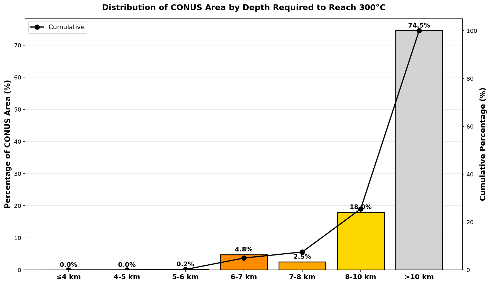
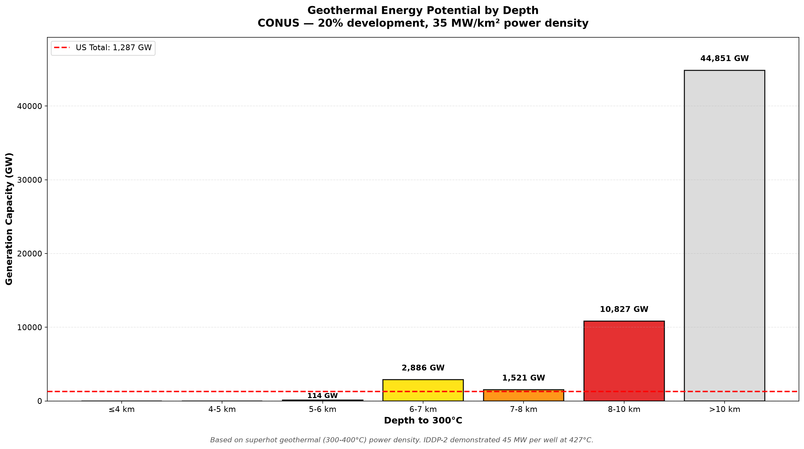
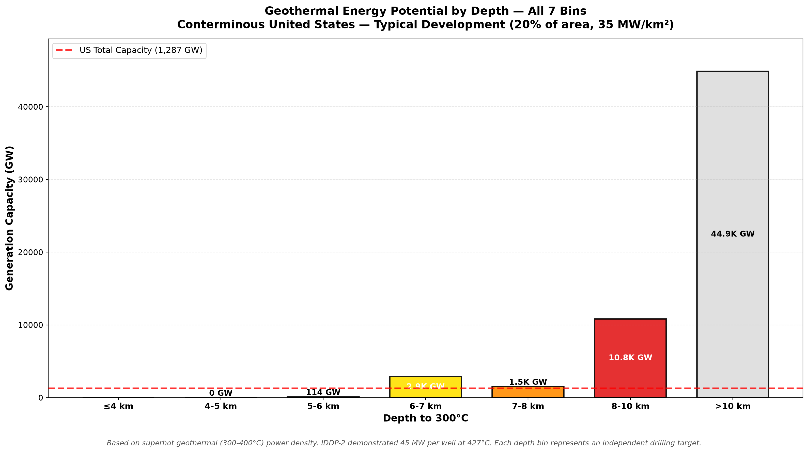

<div align="center">

# 🌋 Depth to 300 °C

### Mapping supercritical geothermal accessibility across the conterminous United States

[](#the-grid)
[](https://data.openei.org/submissions/7669)
[](https://www.smu.edu/dedman/academics/departments/earth-sciences/research/geothermallab/datamaps/temperaturemaps)
[](#license)

**How deep must you drill to hit 300 °C?**
Across 82.8 % of the lower 48, the answer is *deeper than 10 km* — beyond anything
the geothermal industry has ever drilled.

</div>

---

## The map


*Continuous nearest-neighbour field at ~3 km resolution. State outlines are US Census
TIGER 2023 boundaries. Grey regions require >10 km drilling depth.*

**🔍 [Open the interactive, zoomable version →](https://chrissmithphd.github.io/conus-geothermal-300c/)**

<details>
<summary><b>Same data, every model cell plotted discretely</b> (click to expand)</summary>

<br>


All 534,942 cells drawn individually. The rare shallow cells (green = 5–6 km,
blue = 4–5 km) are drawn larger and painted last so they don't vanish at CONUS scale.

</details>

---

## Where the accessible resource actually is

Every accessible cell sits west of roughly **−100° longitude**. The dividing line is
tectonic, not arbitrary: it separates the actively extending, thin-crust West from the cold,
thick, stable craton under the eastern two-thirds of the country.

| Province | States | Typical depth to 300 °C |
|---|---|---|
| **Basin & Range** | NV, UT, S. ID | 6–8 km — largest contiguous target |
| **Cascade arc** | OR, WA, N. CA | 6–7 km, locally 5–6 km |
| **Snake River Plain / Yellowstone** | ID, WY, MT | 6–8 km |
| **Salton Trough / Imperial Valley** | S. CA | 6–7 km |
| **Rio Grande Rift** | NM, W. TX | 7–10 km |
| **Great Plains → Atlantic** | ~40 states | **> 10 km** |

The handful of shallowest cells (**4–5 km**, three cells total) fall along the
Oregon/Washington Cascade axis and coastal Northern California.

---

## Area breakdown



| Depth bin | Area (km²) | % of CONUS | Cumulative % |
|---|---:|---:|---:|
| ≤ 4 km | 0 | 0.00 | 0.00 |
| 4–5 km | 46 | 0.00 | 0.00 |
| 5–6 km | 16,285 | 0.19 | 0.19 |
| 6–7 km | 412,296 | 4.79 | 4.98 |
| 7–8 km | 217,321 | 2.53 | 7.51 |
| 8–10 km | 1,546,782 | 17.99 | 25.50 |
| **> 10 km** | **6,407,277** | **74.50** | 100.00 |
| *Total* | *8,600,008* | *100.00* | |

Areas are **latitude-weighted** (`A = R² · cos φ · Δφ · Δλ`), not raw cell counts, so
Montana cells are not over-credited relative to Texas cells.

---

## Energy Generation Potential



### Capacity by Depth Bin

| Depth Bin | Area (km²) | Capacity (GW) | % of US Total |
|-----------|------------|---------------|---------------|
| ≤4 km | 0 | 0 | 0.0% |
| 4-5 km | 46 | 0.3 | 0.0% |
| 5-6 km | 16,285 | 114 | 8.9% |
| 6-7 km | 412,296 | 2,886 | 224% |
| 7-8 km | 217,321 | 1,521 | 118% |
| 8-10 km | 1,546,782 | 10,827 | 841% |
| >10 km | 6,407,277 | 44,851 | 3,485% |

*US Total: 1,287 GW | US Coal: 180 GW*


*All metrics labeled directly: area (km²), generation capacity (GW), and percentage of CONUS for each depth bin.*



*Individual depth bins showing generation capacity with US total reference line (1,287 GW).*

**Basis:** 35 MW/km² power density (superhot geothermal, 300-400°C), 20% development factor. IDDP-2 (Iceland) demonstrated 45 MW per well at 427°C. See [`ENERGY_GENERATION_RESEARCH.md`](ENERGY_GENERATION_RESEARCH.md) for research details.

---

## Coal Plant Conversion Analysis


*Coal power plants sized by capacity, colored by geothermal depth. Triangles = operating, circles = retired since 2015.*

### Summary

**340 US coal plants analyzed:**
- 23 plants (7%) at ≤10 km depth
- 22 of those in western US
- 317 plants (93%) at >10 km depth

### Top Conversion Candidates

| Rank | Plant | State | Capacity | Status | Depth to 300°C |
|------|-------|-------|----------|--------|----------------|
| 1 | Centralia | WA | 1,460 MW | Operating | 6.2 km |
| 2 | Huntington | UT | 1,016 MW | Operating | 6.7 km |
| 3 | Dave Johnston | WY | 817 MW | Operating | 7.0 km |
| 4 | Boardman | OR | 642 MW | Retired | 7.0 km |
| 5 | Craig | CO | 1,428 MW | Operating | 7.5 km |
| 6 | Navajo | AZ | 2,409 MW | Retired | 8.5 km |
| 7 | San Juan | NM | 1,848 MW | Retired | 10.0 km |


*Western states showing 23 plants at ≤10 km depth.*

### Geographic Distribution

**Western US:** 22 of 50 plants (44%) at ≤10 km depth  
**Eastern US:** 1 of 290 plants (<1%) at ≤10 km depth

**States (100% of plants at ≤10 km):** Utah (7/7), Nevada (3/3), Washington (1/1), Oregon (1/1)

**Data:** EIA Form 860 (2025) + Stanford Thermal Earth Model (2024). See [`COAL_GEOTHERMAL_ANALYSIS.md`](COAL_GEOTHERMAL_ANALYSIS.md) for detailed analysis.

---

## Why 300 °C

Supercritical and superhot geothermal systems are the step change the industry is chasing:

- **~5–10× the energy per well** of a conventional 150–200 °C hydrothermal system
- **Far smaller surface footprint** per installed megawatt
- **Baseload, dispatchable, zero-carbon** — the profile the grid is short of
- An explicit **US DOE Geothermal Technologies Office** target

The reason it isn't everywhere already is the subject of this repository: the heat is real,
but it is *deep*.

---

## Data sources

### Primary — Stanford Thermal Earth Model (2024) · 0–7 km

**Aljubran & Horne (2024)**, *Geothermal Energy* 12(1) · DOI [10.1186/s40517-024-00304-7](https://doi.org/10.1186/s40517-024-00304-7)
Dataset: [OEDI submission 7669](https://data.openei.org/submissions/7669) · Live model: [stm.stanford.edu](https://stm.stanford.edu/)

<a name="the-grid"></a>

| | |
|---|---|
| Depth levels | 0, 1, 2, 3, 4, 5, 6, 7 km |
| Cells | 534,942 per level (~4 km spacing, ~18 km² per cell) |
| Method | Physics-informed graph neural network on bottom-hole temperatures |
| Reported error | **MAE 4.8 °C** |
| Coverage | 24.54–49.37 °N, −124.74 to −66.97 °W · complete CONUS |
| Missing values | **zero** |

**Access note:** the published bulk file is a 5.7 GB CSV. This project instead pulled the
per-depth **ArcGIS FeatureServer** layers, which return the same predictions as paginated
GeoJSON — one clean file per depth, ~132–145 MB each. See [`download_stanford.py`](download_stanford.py).

### Secondary — SMU Geothermal Laboratory (2011) · 7.5–10 km

**Blackwell et al. (2011)** · [SMU Geothermal Lab temperature maps](https://www.smu.edu/dedman/academics/departments/earth-sciences/research/geothermallab/datamaps/temperaturemaps)

Only **rendered PNG maps** are public; the underlying grids are sold, not published. To get
numbers beyond Stanford's 7 km ceiling, the published maps were **digitised**: legend colours
were matched to their temperature classes, map pixels classified by nearest colour, and the
result georeferenced to the CONUS extent.

| | |
|---|---|
| Depth levels | 3.5, 4.5, 5.5, 6.5, **7.5, 8.5, 10** km |
| Points recovered | 3,447,978 (~400–550 k per level) |
| Temperature resolution | **±12.5 °C** (25 °C legend classes, midpoint assigned) |
| Classification rate | ~41–47 % of pixels (remainder is ocean, borders, legend, text) |
| Positional accuracy | ~±5–10 km (no georeferencing metadata in the source images) |

<details>
<summary><b>Digitisation validation</b> — original vs. reconstructed (click to expand)</summary>

<br>


Left: published SMU 6.5 km map. Centre: extracted map area. Right: reconstructed temperature
field. Every major thermal province is reproduced.


</details>

> ⚠️ **This is an approximate re-digitisation of published figures, not the original SMU
> model.** It is used only to bin depths *beyond* Stanford's validated range, never to
> override Stanford where both exist.

---

## Method

```
Stanford GeoJSON (0–7 km)          SMU PNG maps (3.5–10 km)
        │                                   │
        │ 8 depth layers                    │ colour → temperature class
        │ exact °C per cell                 │ pixel classification
        ▼                                   ▼
  linear interpolation                georeference to CONUS
  T(z) → depth where T = 300 °C             │
        │                                   │
        ├── crossing found ≤ 7 km ──────────┤
        │   → depth_300_km (continuous)     │
        │                                   ▼
        └── not reached by 7 km ──→ nearest-neighbour lookup of
                                    SMU 7.5 / 8.5 / 10 km temperatures
                                            │
                                            ▼
                                    assign deeper bin, or > 10 km
```

**1 · Interpolate the Stanford profile.** For each of the 534,942 cells, take the eight
modelled temperatures and linearly interpolate to find where the profile crosses 300 °C.

```python
if temperatures.max() < 300:
    return np.nan                      # not reached inside 0–7 km
return float(interp1d(temperatures, depths)(300))
```

Worked example — 250 °C at 6 km, 320 °C at 7 km:
`6 + (300 − 250)/(320 − 250) × 1 =` **6.71 km**

Result: **27,488 cells (5.1 %)** cross 300 °C within 7 km.

**2 · Extend with SMU past 7 km.** For the 507,454 cells that don't cross inside Stanford's
range, look up the digitised SMU temperature at 7.5, 8.5 and 10 km by nearest neighbour and
assign the first bin where 300 °C is met. This recovers **63,933** more cells. The remaining
**443,521** are classified `> 10 km`.

**3 · Bin, weight, report.** Assign the seven project bins, weight each cell by its true
latitude-corrected surface area, and tabulate.

---

## Results file

[`data/processed/conus_depth_to_300c.csv`](data/processed) (also Parquet)

| column | meaning |
|---|---|
| `lat`, `lon` | cell centre, WGS 84 decimal degrees |
| `depth_300_km` | interpolated crossing depth; `NaN` where 300 °C is not reached by 10 km |
| `depth_bin` | one of the seven categories |
| `source` | `Stanford` (continuous interpolation) or `SMU digitized` (binned) |

The `source` column matters: Stanford rows carry a genuine continuous depth estimate, SMU
rows carry only a bin. Filter on it before doing anything quantitative with `depth_300_km`.

---

## Reproduce it

```bash
python -m venv .venv && source .venv/bin/activate
pip install numpy pandas matplotlib scipy pillow pyarrow geopandas plotly

python download_stanford.py        # ~1 GB from ArcGIS FeatureServer
python digitize_all_smu_maps.py    # PNG maps → 3.4 M gridded points
python calculate_depth_to_300c.py  # interpolate + bin + area-weight
python create_final_maps_v4.py     # publication maps with TIGER state outlines
python create_final_map.py         # interactive zoomable HTML
```

State outlines come from the US Census cartographic boundary file `cb_2023_us_state_20m`,
downloaded into `data/raw/boundaries/`.

---

## Limitations — read before citing

| Issue | Consequence |
|---|---|
| **Stanford stops at 7 km** | Everything deeper leans on the coarser digitised SMU layers |
| **SMU is binned to 25 °C** | ±12.5 °C → roughly **±400 m** of depth uncertainty at a 30 °C/km gradient |
| **SMU digitisation is approximate** | A cell shown as 287.5 °C could genuinely be at 300 °C. Some cells binned 5–7 km here may in truth be shallower. |
| **SMU vintage is 2011** | 13 years older than Stanford; less well data behind it |
| **Linear T(z) between layers** | Real profiles curve; expect ~10–20 % depth error where the gradient changes with depth |
| **~4 km cells** | Sub-grid thermal anomalies are smoothed away |
| **Single 300 °C threshold** | True supercritical conditions depend on pressure, so the target °C should really vary with depth |
| **No extrapolation performed** | By design. Cells beyond 10 km are reported as `> 10 km`, never as an invented number. |

---

## What's next

**Completed Analysis:**
- ✅ Coal plant overlay (23 of 340 plants at favorable depths, see above)
- ✅ Energy generation potential (3,000-10,000+ GW depending on drilling depth)

**Future Enhancements:**

1. **Transmission Analysis** - Distance from geothermal resources to demand centers, HVDC requirements
2. **Economic Modeling** - LCOE estimates for different depth/temperature scenarios with drilling cost sensitivity
3. **Environmental Overlay** - Protected lands, water availability, seismic risk zones
4. **Drilling Technology Roadmap** - R&D requirements to commercialize ultra-deep drilling (>10 km)
5. **Regional Energy Transition Plans** - State-by-state pathways for geothermal development

---

## Repository layout

```
├── README.md
├── index.html                          # interactive map landing page
├── download_stanford.py                # Stanford ArcGIS → GeoJSON
├── digitize_smu_maps.py                # SMU PNG digitisation prototype
├── digitize_all_smu_maps.py            # all 7 SMU depths
├── explore_stanford_data.py            # exploratory stats + plots
├── calculate_depth_to_300c.py          # main analysis
├── create_final_maps_v4.py             # publication maps (TIGER outlines)
├── create_final_map.py                 # interactive Plotly map
├── data/
│   ├── raw/{stanford,smu,boundaries}/  # untouched source data + manifests
│   └── processed/                      # digitised SMU + final depth grid
├── plots/
└── docs/
    ├── DATA_ACQUISITION_REPORT.md
    ├── DATASET_SUMMARY.md
    └── SMU_DIGITIZATION_REPORT.md
```

Large source and derived data files are gitignored; the manifests in
`data/raw/*/manifest.json` record exactly what was fetched, from where, and when.

---

## References

1. **Aljubran, M. J. & Horne, R. N.** (2024). Thermal Earth model for the conterminous
   United States using an interpolative physics-informed graph neural network.
   *Geothermal Energy* **12**(1). DOI [10.1186/s40517-024-00304-7](https://doi.org/10.1186/s40517-024-00304-7) · [arXiv:2403.09961](https://arxiv.org/abs/2403.09961)
2. **Blackwell, D. D., Richards, M., Frone, Z., et al.** (2011). Temperature-at-depth maps
   for the conterminous US and geothermal resource estimates. *GRC Transactions* **35**.
3. **US Census Bureau** (2023). Cartographic Boundary Files — States (1:20,000,000).
4. **OpenEI / NREL** — [Geothermal Data Repository](https://gdr.openei.org)

---

## License

Code: **MIT**. Analysis, figures and documentation: **CC BY 4.0**.
Stanford model data is public (DOE-funded). SMU map images remain the property of the SMU
Geothermal Laboratory and are reproduced here only to validate the digitisation.

## Acknowledgments

Data sources: Stanford Geothermal Program · SMU Geothermal Laboratory · US DOE Geothermal Technologies Office · OpenEI / NREL · US Census Bureau

Analysis conducted with [Claude Code](https://claude.ai/code) (Sonnet 4.5) by Anthropic.

---

<div align="center">

**Christopher Smith** · [@chrissmithphd](https://github.com/chrissmithphd)

*Last updated 2026-09-15*

</div>
